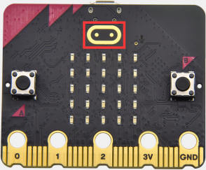
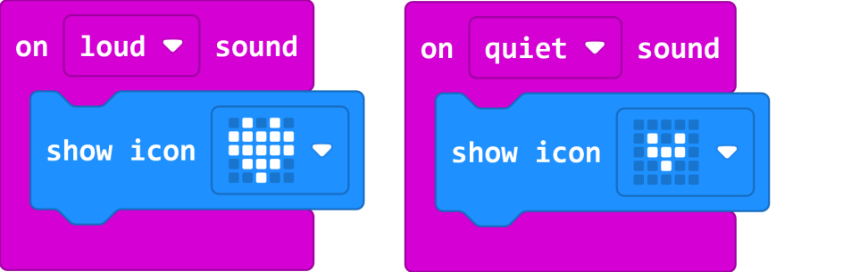
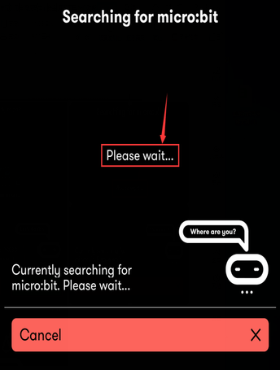

# 3.Micro:bit

# 3.1.Micro:bit驱动安装说明：

如果你已经安装过micro:bit
驱动，就不需要再次安装micro:bit驱动。假如你是首次使用micro:bit主板，则你的电脑需要安装micro:bit驱动，我们提供的micro:bit驱动文件和micro:bit驱动安装手册都在文件夹“Micro:bit
驱动程序下载安装”里面，你可以进入相关文件夹中根据micro:bit驱动安装手册中的说明来安装micro:bit驱动。

# 3.2.代码与编程：

以下的步骤说明基于Windows
操作系统，如果你使用的是其他操作系统，可以将其作为参考。

## 3.2.1快速开始： 

本节介绍如何为micro:bit编写程序以及如何将其下载到micro:bit V2主板。micro:bit官方网站上有非常详细的教程，你可以参考：[https://microbit.org/guide/quick/](https://microbit.org/guide/quick/)

### Step 1: 连接Micro:bit V2主板

通过Micro USB线将micro:bit V2主板连接到电脑，（[使用移动动设备对micro:bit进行编码，请移步查看](https://microbit.org/guide/mobile/)：[https://microbit.org/get-started/user-guide/mobile/](https://microbit.org/get-started/user-guide/mobile/)）
Macs、PCs、 Chromebooks and Linux系统（包括Raspberry Pi）都支持micro:bit V2主板。

新款micro:bit V2主板背后的红色LED会显示，表明micro:bit V2主板有电了。

Micro:bit V2主板将在你的电脑上显示为一个名为'MICROBIT'的驱动器。但请注意，它不是普通的USB磁盘！如下图：

### Step 2: 编写程序： 

在浏览器中访问链接：[https://makecode.microbit.org/](https://makecode.microbit.org/)，然后单击“新建项目”，出现“创建项目”对话框，在对话框中输入“heartbeat”，单击“创建
√”并开始编程。

如果你的电脑具有Windows 10操作系统，则还可以使用Windows 10 App进行编程，这与在浏览器上进行编程完全相同:
[https://www.microsoft.com/zh-cn/p/makecode-for-micro-bit/9pjc7sv48lcx?ocid=badgep&rtc=1&activetab=pivot:overviewtab](https://www.microsoft.com/zh-cn/p/makecode-for-micro-bit/9pjc7sv48lcx?ocid=badgep&rtc=1)

（以下是以Google Chrome为例，其他浏览器类似）

编写一个micro:bit代码。
例如，从模块区拖放一些指令方块放入代码编辑区，然后在MakeCode编辑器中的Simulator上运行你的程序，如下图（和视频）所示，该图（和视频）显示了如何对heartbeat进行编程。如何导入示例代码，请查看后面4.5章节。

下一节将进一步介绍Makecode。

### Step 3: 下载代码：

如果使用Windows 10 App编写程序，则只需单击“下载”按钮，该代码程序将直接下载到micro:bit V2主板，而无需任何其他操作。

如果使用浏览器编写程序，请按照以下步骤操作：

单击编辑器中的“下载”按钮。
这将下载一个“hex”文件，该文件是micro:bit主板可以读取的紧凑程序格式。十六进制文件下载后，将其复制到你的micro:bit V2主板，就像将文件复制到USB驱动器一样。
在Windows上，你还可以右键单击并选择“发送到→MICROBIT（E）”将“hex”文件拷贝到micro:bit V2主板。

也可以将“hex”文件直接拖入MICROBIT（E）磁盘中。

将下载好的“hex”文件拷贝到micro:bit V2主板过程中，micro:bit V2主板背面的黄色信号灯会闪烁，当拷贝完成后黄色信号灯停止闪烁，保持长亮。

### Step 4: 运行程序： 

代码程序上传micro: bit V2主板后，通过micro USB线或外接电源供电给micro:
bit V2主板供电，micro: bit V2主板上5 x 5 LED点阵显示heartbeat的图案。

micro USB线供电 外接电源供电（3V）

Step5：掌握：  
本小节向你展示了如何开始使用micro:bit V2主板，但是除了MakeCode图形化编程之外，你还可以使用其他语言来编写micro:bit的程序代码。转到链接：[https://microbit.org/code/](https://microbit.org/code/)查看不同的语言编程，或查看链接：[https://microbit.org/projects/](https://microbit.org/projects/)，了解你可能想要尝试的一些内容。

## 3.2.2.Makecode：

在Google Chrome访问链接：<https://makecode.microbit.org/>，打开makecode在线版本。或打开
Windows 10 App makecode版本。

点击 “New Project”,出现“创建项目”对话框，在对话框中输入“heartbeat”，单击“创建
√”进入Makecode 编译器，Makecode 编译器如下:

设置

“+”放大，“-”缩小。

恢复撤销

撤销

保存项目

项目名称

代码下载按钮

模块

图形代码和文本代码开关

代码编辑区

Simulator

在代码编辑区中，有两个固定的指令方块“on start”和“forever”。

上电或复位后，“on start”指令方块中的代码将仅执行一次；并且“forever”指令方块中的代码将循环执行。

## 3.2.3.快速下载：

如前所述，如果使用makecode的Windows 10 App，则可以通过单击“下载”按钮将代码快速下载到micro:bit V2主板。

使用makecode的浏览器版本可能需要更多步骤。但是，如果你将Google Chrome用于Linux，macOS和Windows 10系统，则也可以实现快速下载功能。

在这里，我们使用Chrome的webUSB功能，该功能允许网页访问你的micro USB硬件设备。 我们将按照以下步骤完成micro:bit设备与网连接和配对。

配对装置：

用micro USB线连接电脑和micro:bit V2主板。

单击“下载”右边的“...”，然后单击“设备配对”。

然后继续单击“设备配对”按钮。

在弹出窗口中选中对应的“设备”，然后单击“连接”按钮。
如果弹出窗口中没有设备，请参考以下内容：[https://makecode.microbit.org/device/usb/webusb/troubleshoot](https://makecode.microbit.org/device/usb/webusb/troubleshoot)

当然，如果你不想点击链接进入相关页面中查看，你也可以在本教程的文件夹中直接阅读“用WebUSB排除下载过程中的故障.pdf”。

如果你的micro:bit V2主板出现问题是需要更新micro:bit的固件，在本教程的文件夹“如何更新Micro:bit V2主板的固件”中的文件“如何更新micro:bit V2主板的固件.pdf”介绍了如何更新micro:bit的固件，其内容来自：[https://microbit.org/guide/firmware/](https://microbit.org/guide/firmware/)

连接成功后，单击“下载”按钮，程序将直接下载到Micro: bit V2主板，同时还会出现“Download completed!”提示语。

## 3.2.4.资源和代码：

购买后，我们业务会提供一个相关产品的资料链接。资料中主要包含相关工具、测试代码、教程和故障处理方法等，如下图。

## 3.2.5.导入代码：

我们为每个项目提供十六进制代码文件（项目文件）。十六进制代码文件包含项目的所有内容，可以直接导入，你也可以手动拖动代码块来完成每个项目的代码程序。对于简单项目，建议通过拖动代码块来完成项目。
对于复杂的项目，建议通过导入我们提供的十六进制代码文件来完成项目.

接下来，我们以“ Heatbeat”项目为例，介绍如何加载代码。

打开Web版本的makecode或Windows10 APP版本的makecode。

在弹出的对话框中，单击“导入文件”。

选择文件“ ../Makecode Code/Project 1\_ Heart beat/Project 1\_ Heart beat.hex”。 然后点击“继续！”

除了上述将提供的项目代码程序文件直接导入到Makecode
编译器中的方法之外，也可以将我们提供的项目代码程序文件直接拖入到Makecode编译器中的代码编辑区，如下图所示：

几秒钟后，项目成功加载。

注意：如果你的电脑系统是Windows7/8而不是Windows 10，则在Google Chrome中是无法进行设备配对，从而无法直接在串口模拟器上输出一些传感器/模块的数字信号或模拟信号，可是又需要读取相应的传感器/模块的数字信号或模拟信号，那怎么办呢？这里就可以使用CoolTerm软件来读取microbit的串口数据，下面是CoolTerm安装方法。

## 3.2.6.CoolTerm软件安装方法：

这里需要安装CoolTerm程序软件，CoolTerm程序软件是用来在下面的一些实验中读取串口通讯的，这里我们提供了CoolTerm程序软件的下载链接：<https://freeware.the-meiers.org/>

1.  现在，让我们来安装CoolTerm程序软件，这里我们是以PC     Window系统为例，选择下载安装CoolTerm     Win，下载后解压并打开。（Mac系统和 Linux系统也类似）

（2）左键双击程序文件。（注意：必须保证micro:bit驱动已安装和micro:bit V2主板连接到电脑上）

下面列出了工具栏上每个按钮的功能：

||Opens up a new Terminal|
|-|-|
||Opens a saved Connection|
||Saves the current Connection to disk|
||Opens the Serial Connection|
||Closes the Serial Connection|
||Clears the Received Data|
||Opens the Connection Options Dialog|
||Displays the Terminal Data in Hexadecimal Format|
||Displays the Help Window|

# 4.详细课程：

## 实验1: 闪烁的心

1.实验介绍:

这个项目很简单，你可以用一个micro:bit V2主板、一根Micro USB线和电脑就可以实现的，首先在micro:bit LED点阵上显示一个大的“❤”，然后显示小的“❤”，这个循环看起来就像心跳。这也是一个入门实验，让你进入micro:bit的编程世界。

2.所需组件:

- Micro:bit V2主板\*1

- Micro USB 线\*1

3.实验接线:

通过micro USB线将micro:bit V2主板连接到你的电脑上。

4.示例代码:

如果你不熟悉编码，别担心。首先，你可以输入这个链接:
[https://makecode.micro:bit.org/reference](https://makecode.microbit.org/reference)
来了解更多关于 micro: bit blocks
的信息。然后你可以直接进入链接：[https://makecode.micro:bit.org/](https://makecode.microbit.org/)
编辑你的项目程序代码。

5.实验现象:

按照之前的方式将代码下载到micro:bit V2主板，micro USB数据线不要拔下来，利用micro USB数据线上电，micro:bit主板上的LED点阵屏切换显示“❤”图案和“”图案，循环进行。

(如何下载代码？如何快速下载代码？请参考4.3章节)

如果存在下载问题，请断开micro USB线和Micro:bit V2主板连接，然后重新连接它们并重新打开Makecode，以尝试再次下载。

## 实验2: 单个LED闪烁

1.  实验介绍:

在这个项目中，我们尝试控制micro:bit V2主板上的LED点阵中的某个LED闪烁效果。

2.所需组件:

- Micro:bit V2主板\*1

- Micro USB 线\*1

3.实验接线:

通过micro USB线将micro:bit V2主板连接到你的电脑上。

4.元件介绍：

Micro:bit V2主板的LED点阵共由25个发光二极管组成，5个一组，分别对应X和Y方向，形成一个5×5的矩阵，且每个发光二极管是放置在行线（X）和列线（Y）的交叉点上，我们可以通过设置坐标点来实现对25个LED中某一个LED的控制。例如，想要LED点阵中第1行第1个LED点亮，可以设置坐标点为（0，0）；第1行第3个LED点亮，可以设置坐标点为（2，0）；第1列第5个LED点亮，可以设置坐标点为（0，4）；第3列第2个LED点亮，可以设置坐标点为（2，1），依此类推。

5.示例代码:

6.实验现象:

按照之前的方式将代码下载到micro:bit V2主板，利用micro USB数据线上电，可以看到坐标点(1,0)的LED的闪烁，持续1s，接着切换到坐标点(3,4)的LED闪烁，持续1s。循环进行。

## 实验3: LED点阵显示

1.实验介绍:

点阵在我们生活中很常见，很多都有用到它，比如LED广告显示屏，电梯显示楼层，公交车报站等等。

Micro:bit V2主板的LED点阵共由25个发光二极管组成，上一课我们已经讲过通过设置坐标点来实现对LED点阵的25个LED中的某个LED的控制，这样可以通过设置多个坐标点控制多个LED的亮灭使得LED点阵能够显示图案、数字、字符串。我们也可以在特定代码中通过点击
LED点阵的灰白色小正方形点亮
LED点阵对应的LED来实现LED点阵显示图案、数字、字符串。除了上述方法还可以使用自定义图案使LED点阵显示图案。

2.所需组件:

- Micro:bit V2主板\*1

- Micro USB 线\*1

3.实验接线:

通过micro USB线将micro:bit V2主板连接到你的电脑上。

4.示例代码:

5.实验现象:

按照之前的方式将代码下载到micro:bit V2主板，利用micro USB数据线上电，我们就可以看到micro:bit V2主板的5×5 LED点阵开始显示数字1、2、3、4、5，然后循环显示“向下”图案、字符串“Hello!”、“心”图案、“东北”方向图案、“东南”方向图案、“西南”方向图案和“西北”方向图案！

## 实验 4: 可编程按键

1.实验介绍:

按键可以控制电路的通断，把按键接入电路中，不按下按键的时候电路是断开的，按下按键电路导通。

Micro:bit V2主板有三个按键，反面的是复位按钮，正面的是两个可编程按键(A\B)，通过对两个可编程按键组合可以有三种组合，作为输入元件。我们结合上节课的LED点阵，一起来学习按键吧。我们做一个“按键三连”，分别按A、B和AB同时按，对应显示屏分别显示A、B和AB。

2.所需组件:

- Micro:bit V2主板\*1

- Micro USB 线\*1

3.实验接线:

通过micro USB线将micro:bit V2主板连接到你的电脑上。

4.示例代码1:

5.实验现象1:

按照之前的方式将代码下载到micro:bit V2主板，利用micro USB数据线上电，按下micro:bit V2主板上正面按键A且松开，我们可以看到5×5 LED点阵显示字符“A”；按下micro:bit V2主板上正面按键B且松开，我们可以看到5×5 LED点阵显示字符“B”，同时按下micro:bit V2主板上正面按键A和B且都松开，我们就可以看到5×5 LED点阵显示字符“AB”。

6.示例代码2:

7.实验现象2:

按照之前的方式将代码下载到micro:bit V2主板，利用micro USB数据线上电，按下micro:bit V2主板上正面按键A，增加条形图高度，表现为LED点阵亮的行数增加；按下正面按键B，减少条形图高度，表现为LED点阵亮的行数减少。

## 实验 5: 温度检测

1.实验介绍:

本实验项目将介绍Micro:bit V2对外界温度的检测，温度传感器检测范围为：-40℃~105℃。

2.所需组件:

- Micro:bit V2主板\*1

- Micro USB 线\*1

3.实验接线:

通过micro USB线将micro:bit V2主板连接到你的电脑上。

4.示例代码:

5.实验现象:

按照之前的方式将代码下载至micro: bit V2主板，利用micro USB数据线上电，点击“显示控制台(设备)”按钮：

打开串口监视界面，会显示接收到环境温度值，如下图所示：

如果你的电脑系统是Windows7/8而不是Windows 10，则在Google Chrome中是无法进行设备配对，这里需要使用CoolTerm串口监视软件来读取串口数字的。

打开CoolTerm软件，点击Options，选择SerialPort，设置COM口和波特率，波特率设置为115200（经过测试，micro:bit V2主板的USB串口通讯波特率是115200），点击OK后，最后点击Connect。CoolTerm的串口监视器显示当前环境中的温度值变化，如下图：

## 实验6: 地磁传感器

1.实验介绍：

本实验项目主要介绍micro:bit地磁传感器的使用，地磁传感器除了检测地磁场强度外，还能当作指南针确定方向，同时也是航姿参考系统(AHRS)的重要组成部分。micro:bit V2主板采用的是LSM303AGR 地磁传感器，磁场动态范围为±50 gauss。在micro:bit V2主板中，磁力检测、指南针积木块均用到了磁力计模块，本实验中，将先介绍指南针，然后查看磁力计原始数据。常见的指南针主要部件是一根磁针，在地磁场的作用下可以转动并指向地磁北极（地磁北极是在地理南极附近），用来辨别方向。

2.所需组件:

- Micro:bit V2主板\*1

- Micro USB 线\*1

3.实验接线:

通过micro USB线将micro:bit V2主板连接到你的电脑上。

4.示例代码1:

5.实验现象1：

按照之前的方式将代码下载至micro: bit V2主板，micro USB数据线不要拔下来，利用micro USB数据线上电，按下micro:bit V2主板上正面按键A时，micro:bit V2主板首先提示校准，屏幕(LED点阵)提示:“TILT TO FILL SCREEN”,然后进入校准界面，校准方式为：旋转micro:bit V2主板，使得屏幕(LED点阵)画一个封闭的正方形（25个LED都点亮），如下图所示：

当封闭的正方形画好后，会显示一个“笑脸”图案，表示校准完成。

校准完成后，按下按键A的时候，直接在屏幕上显示磁力计的读数，北、东、南、西对应0°、90°、180°、270°。

6.示例代码2:

这个模块意思是，在循环中，不断读取磁力计的读数，并根据读数范围判断所指方向，让箭头指向当前的地磁北极。

如图所示，如果读数在292.5和337.5之间，就让显示屏显示一个指向右上方的箭头，由于代码里不能输入0.5，所以取的判断数值是293和338。之后再加入其它逻辑判断条件，就得到了完整的代码。

完整的示例代码2：

7.实验现象2:

按照之前的方式将代码下载到micro:bit V2主板，利用micro USB数据线上电，提示校准（校准方法请参考:上面示例代码1部分），校准完成后，旋转micro:bit V2主板，可以看到micro:bit V2主板上LED点阵显示方向图案。

## 实验 7: 加速度传感器

1.实验介绍:

micro:bit V2主板内置有LSM303AGR
重力加速度传感器（加速度计），其具有8/10/12 bits的分辨率，代码科设置量程为1g、2g、4g,、8g。

我们常使用加速度计来检测机器的姿态。

在本实验项目中，将介绍加速度传感器（加速度计）对几个特殊姿态的检测，之后来查看加速度传感器输出的三轴原始数据。

2.所需组件:

- Micro:bit V2主板\*1

- Micro USB 线\*1

3.实验接线:

通过micro USB线将micro:bit V2主板连接到你的电脑上。

4.示例代码1:

5.实验现象1:

按照之前的方式将代码下载到micro:bit V2主板，利用micro USB数据线上电，将micro:bit V2主板晃动，则可见LED点阵显示数字1（表明只要有晃动，无论朝哪个方向晃动，该条件都将满足）。

当micro:bit V2主板的Logo朝上时，LED点阵显示数字2，Logo朝上示意图如下所示：

同理，micro:bit V2主板的Logo朝上时，LED点阵显示数字3(倒立的3)，Logo朝下示意图如下所示：

当屏幕朝上（指的是LED点阵朝上）时，LED点阵显示数字4。如下图所示：

同理，当屏幕朝下（指的是LED点阵朝下）时，LED点阵显示数字5。

当micro:bit V2主板向左倾斜（是指LED点阵先朝上，然后再往左边倾斜）时，LED点阵显示数字6。如下图所示：

同理，当micro:bit V2主板向右倾斜（是指LED点阵先朝上，然后再往左边倾斜）时，LED点阵显示数字7。如下图所示：

当不小心碰到micro:bit V2主板使其从桌面掉落，则为做自由落体运动，此时，micro:bit V2主板满足自由落体的条件，则LED点阵显示数字8。（注意：此方法操作时，很容易把micro:bit V2主板摔坏，不建议操作）

注意：（3g、6g、8g，
如果需要满足此条件，则需要达到3倍，6倍，8倍重力加速度甩动micro:bit主板。如果你们有兴趣的话，这部分代码可以自己添加）

6.示例代码2：

7.实验现象2：

按照之前的方式将代码下载到micro:bit V2主板，利用micro USB数据线上电，点击“显示控制台(设备)”按钮：

首先，查阅MMA8653FC数据手册，以及micro:bit V2主板的硬件原理图得知，micro:bit V2主板的加速度计坐标如下图所示：

显示出如下界面：分别显示了加速度在X轴，Y轴，Z轴的分解值，以及加速度的合成(重力加速度及其它外力作用的加速度合成):

如果你的电脑系统是Windows7/8而不是Windows 10，则在Google Chrome中是无法进行设备配对，这里需要使用CoolTerm软件来读取串口数字的。

打开CoolTerm，点击Options，选择SerialPort，设置COM口和波特率，波特率设置为115200（经过测试，micro:bit V2主板的USB串口通讯波特率默认是115200），点击OK后，最后点击Connect。CoolTerm串口监视器分别显示了加速度X轴、Y轴、Z轴的数据，如下图：

## 实验 8: 光照强度检测

1.实验介绍:

本实验项目将介绍micro:bit V2主板对外界光照强度的检测，是通过LED点阵检测光线强度的，原理是通过反复的将LED驱动器转换成输入并采样电压衰弱时间，这与环境光的水平大致成正比。就当做是一个光敏传感器来使用就可以了。

2.所需组件:

- Micro:bit V2主板\*1

- Micro USB 线\*1

3.实验接线:

通过micro USB线将micro:bit V2主板连接到你的电脑上。

4.示例代码:

5.  实验现象:

按照之前的方式将代码下载到micro:bit V2主板，利用micro USB数据线上电，点击“显示控制台(设备)”按钮：

显示串口输出数据，用手全部遮住micro:bit V2主板的LED点阵，光线亮度级别约为0；然后将micro:bit V2主板的LED点阵放置于光照下，随着光照强度增强，亮度级别值也在逐渐增大。如下图所示：

代码中的20是一个随意设置的光照强度级别值，如果当前光照强度级别小于等于20，月亮就会出现在micro:bit V2主板的LED点阵上。如果大于20时，太阳就会出现。

如果你的电脑系统是Windows7/8而不是Windows 10，则在Google Chrome中是无法进行设备配对，这里需要使用CoolTerm软件来读取串口数字的。

打开CoolTerm，点击Options，选择SerialPort，设置COM口和波特率，波特率设置为115200（经过测试，micro:bit V2主板的USB串口通讯波特率是115200），点击OK后，最后点击Connect。这样，CoolTerm串口监视器显示光线亮度级别值。

## 实验 9: 扬声器

1.  实验介绍：

新款的micro:bit V2主板有内置扬声器，这使得在你的项目中添加声音变得非常容易。通过编程使扬声器发出各种各样的音调，例如编写一首歌曲：《欢乐颂》，让扬声器播放出来。

2.所需组件:

- Micro:bit V2主板\*1

- Micro USB 线\*1

3.实验接线:

通过micro USB线将micro:bit V2主板连接到你的电脑上。

4.示例代码1:

5.实验现象1:

按照之前的方式将代码下载到micro:bit V2主板，利用micro USB数据线上电，micro:bit V2主板上的扬声器发出声音且LED点阵显示音乐标志图案.

6.示例代码2:

歌曲《欢乐颂》的简谱如下：

更多音乐简谱知识的相关链接：[https://en.wikipedia.org/wiki/Numbered_musical_notation](https://en.wikipedia.org/wiki/Numbered_musical_notation)

7.  实验现象2:

按照之前的方式将代码下载到micro:bit V2主板，利用micro USB数据线上电，micro:bit V2主板上的内置扬声器播放一首《欢乐颂》歌曲。

## 实验 10: 触摸感应logo

1.  实验介绍：

如果你有了新款的micro:bit V2主板，你可以在你的项目中使用金色的触摸感应logo作为另一个输入，这就像多了一个按钮。触摸感应采用的是电容式触摸传感器，当你手指按下（或触摸）它时，它就能感应到电场的微小变化----就像你的手机或平板电脑屏幕一样。当你像按按钮一样按下它时，你可以在程序中触发事件。

2.所需组件:

- Micro:bit V2主板\*1

- Micro USB 线\*1

3.实验接线:

通过micro USB线将micro:bit V2主板连接到你的电脑上。

4.示例代码:

5.实验现象:

按照之前的方式将代码下载到micro:bit V2主板，利用micro USB数据线上电，手指按住micro:bit V2主板上“Logo”标志处，micro:bit V2主板上的LED点阵显示“❤”图案；手指松开micro:bit V2主板上“Logo”标志处，会出现数字。

## 实验 11: 麦克风

1.实验介绍：

新款的micro:bit V2主板有一个内置麦克风，可以测量环境的声音程度。你可以使用它作为一个简单的输入---当你鼓掌时，micro:bit主板上前面内置麦克风LED指示灯会被打开。它还可以测量声音的强度，所以你可以制作一个噪音等级表或与音乐合拍的迪斯科灯光。麦克风是在新款的micro:bit V2的背面，而在前面，你会发现一个内置麦克风LED指示灯，还有紧挨着让声音进入麦克风的孔。当你的micro:bit V2主板在测量声音级别时，它就会亮起来。

2.所需组件:

- Micro:bit V2主板\*1

- Micro USB 线\*1

3.实验接线:

通过micro USB线将micro:bit V2主板连接到你的电脑上。

4.示例代码1:

5.实验现象1：

按照之前的方式将代码下载到micro:bit V2主板，利用micro USB数据线上电，当你鼓掌时，micro:bit V2主板上的LED点阵显示“❤”图案；当外界环境安静时，micro:bit V2主板上的LED点阵显示“”图案。

6.  示例代码2:

7.  实验现象2：

按照之前的方式将代码下载到micro:bit V2主板，利用micro USB数据线上电，点击“显示控制台(设备)”按钮：

显示串口输出数据，当外界环境的声音增大时，串口输出的声音级别值也增大，如下图所示：

并且，当你按下micro:bit V2主板上的A键时，micro:bit V2主板上的LED点阵显示检测到的此时环境中最大声音级别值（这里需要注意：通过按micro:bit背面的重置按钮重置最大值。）；当鼓掌时，LED点阵显示声音级别大小图案。

## 实验 12: 读取蓝牙数据

1.  实验说明：

micro:bit V2主板自带了[nRF52833](https://www.nordicsemi.com/Products/Low-power-short-range-wireless/nRF52833)处理器（内置蓝牙5.1低功耗的BLE(Bluetooth Low Energy)设备）以及2.4GHz天线，可进行蓝牙无线通信和2.4GHz无线通信。使得micro:bit V2主板可以与各种蓝牙设备进行通信，包括智能手机和平板电脑。

在本实验中，主要讲解micro:bit V2主板实现蓝牙无线通信功能，我们可以通过连接蓝牙，实现无线传输代码（信号）功能。我们利用一个苹果系统设备（手机/iPad）和micro:bit V2主板连接，实现无线传输功能。设置安卓系统手机实现无线传输方法和苹果系统设备（手机/iPad）类似，这里就不一一介绍了。

2.  准备：

1.  通过micro USB线将micro:bit V2主板连接到电脑上。

2.  苹果系统设备（手机/iPad）或安卓系统手机。

3.  实验步骤：

（1）如果你的智能手机/iPad是苹果系统的，需要先在电脑上进入网页：<https://www.microbit.org/get-started/user-guide/ble-ios/>
，点击“Download pairing HEX file”下载micro:bit的固件到创建的文件夹中或电脑桌面上，并将下载好的micro:bit固件烧入micro:bit V2主板中。（这一步只针对于苹果系统的智能手机/iPad）

（2）在苹果系统设备（手机/iPad）上打开，在App Store的搜索框中输入“micro bit”，然后选中micro:bit
选项，会出现下载界面（如下图所示：），点击“”，就可以下载安装对应的APP。

（3）苹果系统设备（手机/iPad）和micro:bit V2主板配对连接。

1.  打开苹果系统设备（手机/iPad）上的蓝牙。

2.  APP安装成功后，点击打开APP，先确定micro     USB数据线已经将micro:bit     V2主板和电脑连接上，再点击APP的第一项“Choose     micro:bit”，开始配对蓝牙。

3.  点击配对一个新的micro:bit，开始配对。

4.  根据提示，首先同时按住micro:bit     V2主板上的按键A和B，然后按下micro:bit     V2主板后面的复位&电源按钮几秒钟（按键A和B不能松开），再松开复位&电源按钮，micro:bit     V2主板上LED点阵会显示一个密码图案。最后松开micro：bit     V2主板上的按键A和B，接着点击“下一步”。

5.  在苹果系统手机/iPad上设置密码图案，使图案和micro:bit     V2主板上显示的密码图案一样，点击“下一步”。

6.  点击“下一步”，出现对话框，在对话框中点击“Pair”。几秒钟后，配对成功，同时micro:bit     V2主板上的LED点阵显示“√”图案。

（3）蓝牙配对成功后，开始利用APP编写代码，并上传代码。

a.点击第二项“Create Code”，进入编程界面，开始编写代码程序。（点击，出现对话框，在对话框中直接点击“Create
√”后就进入编程界面）

b\.
将代码程序项目名称设置为“1”，点击保存图案“”，保存代码程序。

c.项目代码程序保存成功后，点击第三项“Flash”进入上传代码程序界面。默认选择代码程序是刚刚保存的项目名称为“1”的代码程序，然后点击“Flash”上传代码程序“1”。

d.几秒钟后，代码程序“1”上传成功，会显示如下图。然后micro:bit V2主板上的LED点阵显示跳跃的“心”对应图案。

## 实验13 LED闪烁

实验说明

LED 闪烁实验是比较基础的实验之一，在使用方法中，我们控制的是micro:
bit自带的5 x 5 LED点阵。在这个实验中我们利用外接直插LED 灯来完成LED
闪烁实验，实验中我们先关闭5 x 5 LED点阵功能。

实验器材

micro：bit主板\*1

micro bit T型扩展板 \*1

USB线\*1

LED\*1

220Ω 电阻\*1

面包板\*1

面包板连接线若干

接线图

测试代码

测试结果

上传完代码，上电后，我们就可以看到IO口外接小灯在闪烁了，实验现象为LED不停闪烁，间隔大约为0.5秒。

## 实验14 广告灯

实验说明

在生活中我们经常会看到一些由各种颜色的led灯组成的广告牌，广告牌上各个位置上癿led灯不断的变话,形成各种效果。本节实验就是利用led灯编程模拟广告灯效果。

实验器材

micro：bit主板\*1

micro bit T型扩展板 \*1

USB线\*1

LED\*5

220Ω 电阻\*5

面包板\*1

面包板连接线若干

接线图

测试代码

测试结果

上传完代码，上电后，我们就可以看到IO口外接小灯先逐个变亮，然后逐个变暗，循环交替。

## 实验15 按键控制LED实验

实验说明

Micro bit自带3个按键，其中2个用户按键和1个复位按键。本实验中，我们只是利用一个micro bit自带的用户按键控制一个外接的LED的亮和灭。

实验器材

micro：bit主板\*1

micro bit T型扩展板 \*1

USB线\*1

LED\*1

220Ω 电阻\*1

面包板\*1

面包板连接线若干

接线图

测试代码

测试结果

下载完代码，上电后，当按下micro bit板A按键时小灯亮起，否则小灯不亮。

## 实验16 抢答器

实验说明

上面上面实验中我们用micro bit自带的按键控制LED灯，这个实验它扩展下，做一个抢答器实验。实验中我们用一个自带的按键当做复位按键，另外外接两个轻触按键当做抢答按键，用于控制两个外接的LED灯。

实验器材

micro：bit主板\*1

micro bit T型扩展板 \*1

USB线\*1

LED\*2

轻触按键\*2

220Ω 电阻\*2

10KΩ 电阻\*2

面包板\*1

面包板连接线若干

接线图

测试代码

测试结果

下载完代码，上电后，一个简单的抢答器就做好了，我们根据LED灯显示的颜色判断是谁抢答成功。在按下micro bit板A按键复位后，两个LED灯关闭。

## 实验17 呼吸灯

实验说明

上面实验中我们控制LED的亮灭，这个实验中我们利用代码控制LED的亮度，实验中我们模拟呼吸情况，控制灯逐渐亮起和逐渐熄灭。实验中我们分别控制micro bit上5 x 5 LED点阵上LED和外接LED实现呼吸灯的功能，其中外接LED需接在模拟口上。

实验器材

micro：bit主板\*1

micro bit T型扩展板 \*1

USB线\*1

LED\*1

220Ω 电阻\*1

面包板\*1

面包板连接线若干

接线图

测试代码

点阵LED

外接LED

测试结果

下载完代码，上电后，LED逐渐变暗和逐渐变亮，循环交替，如呼吸一样。

## 实验18 电位器调控灯光亮度

实验说明

在上面实验中我们直接在代码中控制LED的亮度，在这个实验中我们用电位器来调节LED的亮度。实验中外接LED和电位器接口都必须接在模拟口上。

实验器材

micro：bit主板\*1

micro bit T型扩展板 \*1

USB线\*1

LED\*1

220Ω 电阻\*1

可调电位器\*1

面包板\*1

面包板连接线若干

接线图

测试代码

测试结果

上传代码，上电后，我们可以通过旋转可调电位器调节外接LED的亮度。

## 实验19 RGB灯闪烁

实验说明

RGB色彩模式是工业界的一种颜色标准，是通过对红(R)、绿(G)、蓝(B)三个颜色通道的变化以及它们相互之间的叠加来得到各式各样的颜色的，RGB即是代表红、绿、蓝三个通道的颜色，这个标准几乎包括了人类视力所能感知的所有颜色，是目前运用最广的颜色系统之一。

这个实验中我们用一个RGB灯，通过控制R、 G、
B三个引脚的电压输入可以调节三种基色（红/蓝/绿）的强度，从而实现全彩的混色效果。

实验器材

micro：bit主板\*1

micro bit T型扩展板 \*1

USB线\*1

F5-全彩RGB透明共阴\*1

面包板\*1

面包板连接线若干

接线图

测试代码

测试结果

按照上图接好线，上传好代码，上电后，RGB灯会陆续显示红色1S，绿色1S，蓝色1S，黄色1S，紫色1S，白色1S，然后循环交替。

## 实验20 感光灯

实验说明

本次实验我们先进行一个较为简单的光敏电阻的使用实验。光敏电阻可以根据光强改变阻值的元件，本实验可以借鉴电位器调控灯光亮度实验，将电位计换做光敏电阻实现当光强不同时LED
小灯的亮度也会有相应的变化。

实验器材

micro：bit主板\*1

micro bit T型扩展板 \*1

USB线\*1

LED\*1

220Ω 电阻\*1

5MM 光敏电阻\*1

10KΩ 电阻\*1

面包板\*1

面包板连接线若干

接线图

测试代码

测试结果

上传完程序，上电后，光敏电阻感应到灯光越亮，小灯越暗；光敏电阻感应到灯光越暗，小灯越亮。

## 实验21 有源蜂鸣器

实验说明

蜂鸣器可分为有源蜂鸣器和无源蜂鸣器两种。本课程中主要用到了有源蜂鸣器，有源蜂鸣器内部有一简单的振荡电路，能将恒定的直流电转化成一定频率的脉冲信号。实验中中我们只需要给蜂鸣器输入一个高电平信号，蜂鸣器响起。

实验器材

micro：bit主板\*1

micro bit T型扩展板 \*1

USB线\*1

有源蜂鸣器\*1

面包板\*1

面包板连接线若干

接线图

测试代码

测试结果

上传完代码，上电后，我们可以听到蜂鸣器响0.5秒，停止响起0.5秒，循环交替。

## 实验22 无源蜂鸣器

实验说明

蜂鸣器可分为有源蜂鸣器和无源蜂鸣器两种。本课程中主要用到了无源蜂鸣器，无源蜂鸣器内部不带振荡源，直流信号无法令其鸣叫，须用方波驱动。

实验器材

micro：bit主板\*1

micro bit T型扩展板 \*1

USB线\*1

无源蜂鸣器\*1

面包板\*1

面包板连接线若干

接线图

测试代码

测试结果

上传完代码，上电后，我们可以听到蜂鸣器会想响起《欢乐颂》的曲子。

## 实验23 电位器调控舵机转动

实验说明

舵机是一种位置伺服的驱动器，主要是由外壳、电路板、无核心马达、齿轮与位置检测
器所构成。舵机有很多规格，但所有的舵机都有外接三根线，分别用棕、红、橙三种颜色进行区分，由于舵机品牌不同，颜色也会有所差异，棕色为接地线，红色为电源正极线，橙色为信号线。

S

VCC

GND

这个实验中，我们用一个电位器调节一个舵机的转动角度，旋转电位器时，舵机也随之转动。

特别注意：测试舵机时，只能用Micro USB线给micro:bit控制板供电。不能利用电池盒外接3.3V给micro:bit控制板供电。

实验器材

micro：bit主板\*1

micro bit T型扩展板 \*1

USB线\*1

9G 舵机\*1

可调电位器\*1

面包板\*1

面包板连接线若干

接线图

测试代码

测试结果

上传代码，上电后，我们可以通过旋转可调电位器调节舵机的转动角度。

## 实验24 火焰报警

实验说明

火焰传感器是机器人专门用来搜寻火源的传感器，本传感器对火焰特别灵敏。火焰传感器利用红外线对火焰非常敏感的特点，使用特制的红外线接收管来检测火焰，然后把火焰的亮度转化为高低变化的电平信号。

实验中，我们把火焰的亮度转化为高低变化的电平信号输入到micro bit主板中，然后控制蜂鸣器的响起。

实验器材

micro：bit主板\*1

micro bit T型扩展板 \*1

USB线\*1

火焰传感器\*1

有源蜂鸣器\*1

10KΩ 电阻\*1

面包板\*1

面包板连接线若干

接线图

火焰传感器连接方法

测试代码

测试结果

上传代码，上电后，当火焰传感器检测到附近有火焰时，有源蜂鸣器响起，否则有源蜂鸣器不响。

## 实验25 一位数码管显示

实验说明

数码管是一种半导体发光器件，其基本单元是发光二极管。数码管按段数分为七段数码管和八段数码管，八段数码管比七段数码管多一个发光二极管单元（多一个小数点显示），本实验所使用的是八段数码管。数码管共有七段显示数字的段，还有一个显示小数点的段。当让数码管显示数字时，只要将相应的段点亮即可。

这个实验中我们用了一个共阴极八段数码管，把a接到了micro bit主板的P13，b接到了P14，c接到了P8，d接到了P9，e接到了P10，f接到了P12，g接到了P11，h接到了P7，只要控制对应接口的高低电平，即可控制数码管的显示。实验中，我们让数码管逐渐显示0-9 10个数字。

实验器材

micro：bit主板\*1

micro bit T型扩展板 \*1

USB线\*1

一位数码管\*1

面包板\*1

面包板连接线若干

接线图

测试代码

测试结果

上传代码，上电后，数码管循环显示0～9 10个数字。

## 实验26 魔术光杯

实验说明

倾斜开关的工作原理是当开关一端低于水平位置倾斜，开关寻通；当另一端低于水平位置倾斜
，开关停止。魔术光杯实验原理是利用模拟值调光的原理，两个LED的亮度发生变化。

这个实验中倾斜开关提供数字信号，触发模拟值的调节，通过程序的设计，我们就能看到类似于两组装满光的杯子倒来倒去的效果了。

实验器材

micro：bit主板\*1

micro bit T型扩展板 \*1

USB线\*1

滚珠开关\*2

LED\*2

10KΩ 电阻\*2

面包板\*1

面包板连接线若干

接线图

测试代码

测试结果

按照上图接好线，上传好代码，上电后，将两个倾斜开关同时倾斜一边，
一个LED逐渐变暗，同时另一个逐渐变亮，最终一个LED完全熄灭，一个LED最亮。

## 实验27 micro bit 模拟量的读取

实验说明

玩过Arduino的朋友都知道，有数字口（D口）和模拟口（A口），分的非常清楚。

在micro:bit中，我们通过引脚说明图也能看清哪几个引脚是支持模拟量读取的。我们

看下图。

这个实验中我们用一个可调电位器调节P2的模拟量，旋转点位器时，模拟量发生变化，并在串口监视器上显示出来。实验中我们要用到一个串口通讯软件，这里我们用的是Arduino IDE。

实验器材

micro：bit主板\*1

micro bit T型扩展板 \*1

USB线\*1

可调电位器\*1

面包板\*1

面包板连接线若干

接线图

测试代码

测试结果

按照上图接好线，上传好代码，micro USB线上电后。打开CoolTerm，点击Options，选择SerialPort，设置COM口和波特率，波特率设置为115200（经过测试，micro:bit V2主板的USB串口通讯波特率默认是115200），点击OK后，最后点击Connect。CoolTerm串口监视器显示对应数值，旋转可调电位器，数值变化，发现最大是1023，最小是0，如下图：

## 实验28 热敏电阻传感器

实验说明

热敏电阻能够实时感知周边环境温度的变化，随着温度变化，热敏电阻也发生变化。实验中，我们搭配好电路，把温度变化转换成电压变化，将对应的电压输入到micro bit主板的P2上。实验中我们把P2的模拟量在串口监视器上显示出来。实验中我们要用到一个串口通讯软件，这里我们用的是Arduino IDE。

实验器材

micro：bit主板\*1

micro bit T型扩展板 \*1

USB线\*1

5MM 103 阻值 10K 绿色\*1

10KΩ 电阻\*1

面包板\*1

面包板连接线若干

接线图

测试代码

测试结果

按照上图接好线，上传好代码，micro USB线上电后。打开CoolTerm，点击Options，选择SerialPort，设置COM口和波特率，波特率设置为115200（经过测试，micro:bit V2主板的USB串口通讯波特率默认是115200），点击OK后，最后点击Connect。CoolTerm串口监视器显示对应数值，当温度升高，电阻减小，模拟值增大；当人体对准温度电阻呼气时，温度升高，如下图：

## 实验29 LM35 温度传感器

实验说明

LM35
是很常用且易用的温度传感器元件，在元器件的应用上也只需要一个LM35元件，只利用一个模拟接口就可以测出当前温度。它的输出电压与摄氏温标呈线性关系，转换公式如式，0时输出为0V，每升高1℃，输出电压增加10mV。

实验中我们将它的输出电压输入到micro bit主板的P2上，而后通过相关公式计算出当前环境中的温度值，并在串口监视器上显示出来。实验中我们要用到一个串口通讯软件，这里我们用的是Arduino IDE。实验时，需特别注意LM35的方向，如若接反，会把LM35传感器烧毁，接口方向如下。

实验器材

micro：bit主板\*1

micro bit T型扩展板 \*1

USB线\*1

LM35DZ\*1

面包板\*1

面包板连接线若干

接线图

测试代码

测试结果

按照上图接好线，上传好代码，micro USB线上电后。打开CoolTerm，点击Options，选择SerialPort，设置COM口和波特率，波特率设置为115200（经过测试，micro:bit V2主板的USB串口通讯波特率默认是115200），点击OK后，最后点击Connect。CoolTerm串口监视器显示当前环境中的温度值，如下图：

# 5.资源链接：

<https://makecode.microbit.org/>

<https://tech.microbit.org/hardware/>

<https://microbit.org/new-microbit/>

<https://www.microbit.org/get-started/user-guide/overview/>

<https://microbit.org/get-started/user-guide/features-in-depth/>

<https://tech.microbit.org/hardware/edgeconnector/>

<https://microbit.org/guide/hardware/pins/>

<https://microbit.org/guide/quick/>

<https://microbit.org/get-started/user-guide/mobile/>

<https://microbit.org/code/>

<https://microbit.org/projects/>

