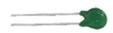

# 2.产品清单：

|编码|规格型号|数量|图片|
|-|-|-|-|
|1|micro：bit V2主板|1||
|2|Micro USB线 1米|1||
|3|带开关和接线电池盒|1||
|4|面包板连接线30根 环保|1||
|5|400孔 ZY-60白色 面包板|1||
|6|micro bit T型扩展板|1||
|7|电阻卡|1||
|8|一位数码管 0.56英寸共阴红|1||
|9|SG90 9G 蓝色辉盛 90度 舵机 23*12.2*29mm|1||
|10|有源蜂鸣器|1||
|11|无源蜂鸣器|1||
|12|12*12*7.3MM 插件轻触开关|2||
|13|A24 黄帽 按键帽|2||
|14|金属膜色环 1/4W 1% 220R 编带 环保|10||
|15|金属膜色环 1/4W 1% 1K 编带|10||
|16|金属膜色环 1/4W 1% 10K 编带 环保|10||
|17|F5-红发红-短 环保|5||
|18|F5-黄发黄-短 环保|5||
|19|F5-蓝发蓝-短 环保|5||
|20|F5-绿发绿-短 环保|5||
|21|F5-全彩RGB透明共阴 环保|1||
|22|10K 可调电位器 针长6.5MM 环保|1||
|23|5516 亮电阻5-10KΩ 暗电阻0.2MΩ 光敏电阻|3||
|24|5MM 103 阻值 10K 热敏电阻|1||
|25|LM35DZ 原装|1||
|26|红外接收 5MM 火焰 环保|1||
|27|AETHDX-2801 滚珠开关 环保|2||

