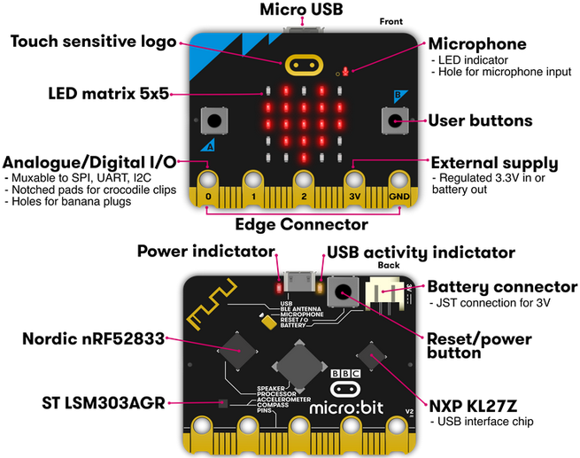
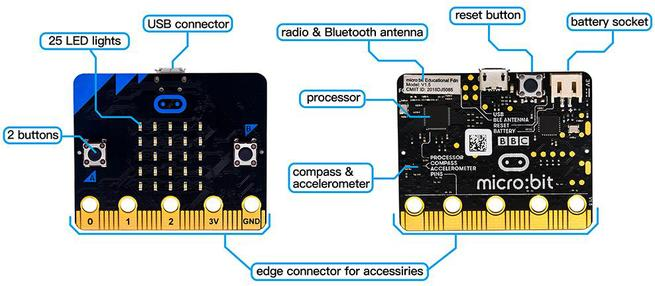
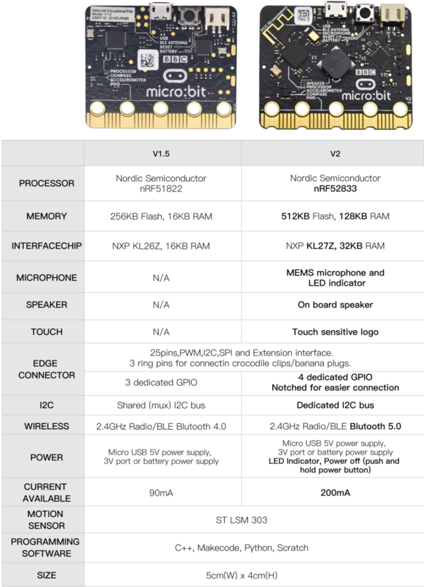
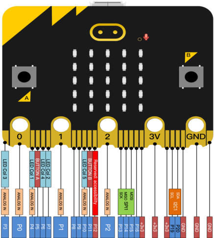
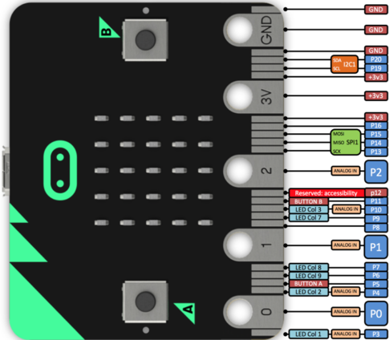

Microbit V2.0入门学习套装

# 1.产品简介：

（1）Micro:bit是什么?

Micro:bit主板是英国广播公司设计的，旨在帮助7年级（11-12岁）及以上的孩子更好地学习编程。Micro:bit主板拥有丰富的板资源，包括一个5\*5 LED点阵、2个可编程按钮、指南针、Micro USB端口、蓝牙模块等。它只有信用卡一半大小(4cm×5cm)，但功能非常强大。它可以用于编写电子游戏，声光互动，机器人控制，科学实验，可穿戴装置开发等，可以实现任何酷炫的小发明，无论是机器人还是乐器，没有做不到只有想不到。

新款的Micro:bit V2主板上有一个可触摸感应的Logo和MEMS麦克风。背面还添加了一个蜂鸣器，这样就可以在没有外部设备的情况下播放各种声音。底部的金手指加上齿轮设计，方便用户更好地固定鳄鱼夹。此外，Micro:bit V2主板还支持休眠模式，用户可以长按Micro:bit V2主板后面的复位&电源按钮，使其进入睡眠模式，降低电池功耗。最重要的特点是Micro:bit V2主板的CPU性能比V1.5版本好得多，外加更多的RAM。所以Micro:bit V2允许用户扩展更多的功能，创造更多的创意作品。

为了方便学习micro bit单片机和一些基础电子知识，我们特别搭配了这个套件。套件主要包含一个micro bit控制板和与控制板搭配使用的配件。其中套机里电池盒里需安装两个1.5V的电池，电池盒上自带拨码开关；使用时可直接连接micro bit控制板供电，电池盒的拨码开关作为电源控制开关。

同时，我们还根据micro bit控制板和相关配件，设计一些特定的学习课程，课程包含接线方法，测试代码等，让你对micro bit单片机和电子知识有个更深刻的认识。

（2）Micro:bit主板硬件分布图介绍：

Micro:bit V2主板

Micro:bit V1.5主板

Micro:bit V2主板与Micro:bit V1.5主板的比较：

在新款Micro:bit V2主板上按下复位&电源按钮将重置micro:bit并重新运行程序。如果你按住它，红色的LED就会慢慢褪色。当电源指示灯变暗时，松开按钮，你的micro:bit主板就会进入省电睡眠模式。通过这种方法可以让你的电池用的更持久，再次按下此按钮可以来唤醒你的Micro:bit。

有关更多内容，请参阅：[https://tech.microbit.org/hardware/](https://tech.microbit.org/hardware/)

<https://microbit.org/new-microbit/>

[https://www.microbit.org/get-started/user-guide/overview/](https://www.microbit.org/get-started/user-guide/overview/)

[https://microbit.org/get-started/user-guide/features-in-depth/](https://microbit.org/get-started/user-guide/features-in-depth/)

（3）Micro:bit引脚配置介绍，如下图所示：

Micro:bit V2主板 Micro:bit V1.5主板

详细信息请参考官方网站：[https://tech.microbit.org/hardware/edgeconnector/](https://tech.microbit.org/hardware/edgeconnector/)

<https://microbit.org/guide/hardware/pins/>

（4）新款Micro:bit V2主板使用注意事项：

- a\. Micro:bit   V2主板上有很多精密的电子元件，建议戴上硅胶保护套进行使用，防止短路。

- b\. Micro:bit   V2主板的IO口驱动能力很弱，IO口电流不足300mA，请勿接大电流器件（例如大舵机MG995、直流电机），否则会烧坏Micro:bit   V2主板，使用前必须完全了解清楚你所使用的器件电流情况，一般建议配搭Micro:bit扩展板进行使用。

- c\. 供电建议从Micro:bit V2主板的USB口进行供电，或者Micro:bit   V2主板上的3V电池座接口。Micro:bit   V2主板本身IO口是3V电平，所以是不支持5V传感器的，如需支持5V传感器需要使用
  Micro:bit扩展板。

- d\. 使用与Micro:bit   V2主板LED点阵的共用引脚（如P3、P4、P6、P7、P10），记得在代码中把LED点阵禁用掉，否则会有LED点阵显示杂乱和可能让所接传感器数据出错的现象。

- e\. 3V电池座接口上不能使用超过3.3V电池，否则很容易会把Micro:bit   V2主板烧坏。

- f\. 禁止放在金属制品上使用，以免发生短路。

总结：Micro:bit V2主板就像是一台微型计算机，它使编程变得有形，并促进数字创造力。关于编程环境，BBC提供了一个在线编程网站：<https://microbit.org/code/>，该网站有一个易于使用的图形化程序MakeCode。
